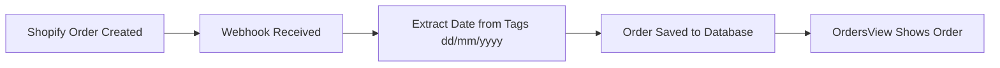
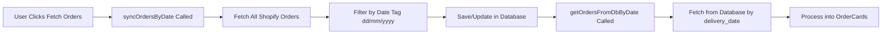
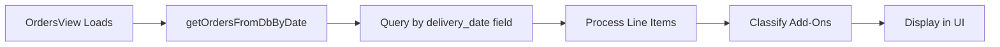
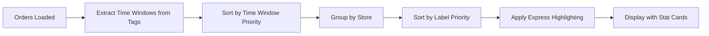

# OrdersView Logic Implementation

## Overview
This document outlines the logic for OrdersView to properly handle Shopify orders, line items, quantities, add-on classification, and the new webhook-based ingestion and management flow.

---

## Updated Architecture (as of 2025-01-24)

### 1. Shopify Webhook Integration (Primary Source of Truth)
- Orders are received in real time via the Shopify `orders/create` webhook.
- **Date Extraction**: Delivery date is extracted **ONLY from Shopify order tags** in `dd/mm/yyyy` format.
- Each order is saved to the database, associated with the extracted date tag.
- No manual processing is needed for new orders—they appear automatically for the correct date in the UI.

### 2. Process Orders Button (Manual Sync/Update & Fetch)
- The "Fetch Orders" button is retained in the UI.
- When clicked, it will:
  - **Fetch new orders from Shopify** for the selected date (using the `dd/mm/yyyy` tag).
  - **Add any new orders** that are not already in the database (prevents duplicates).
  - **Update existing saved orders** for the selected date (refresh status, line items, etc.).
  - **Never create duplicates**—only new or updated orders are saved.

### 3. Bulk Delete Orders
- A bulk delete button is available in OrdersView.
- Allows the user to delete all orders for the selected date (or all currently displayed orders) in one action.
- Useful for clearing out test data or resetting a day's orders.

---

## Enhanced OrdersView Requirements (2025-01-24)

### 📊 Clickable Stat Cards & Filtering System

#### **Row 1 - Core Metrics (Clickable Filters)**
1. **Total Orders** - Click to show all orders
2. **Unassigned Orders** - Click to filter unassigned orders
3. **Assigned Orders** - Click to filter assigned orders  
4. **Completed Orders** - Click to filter completed orders

#### **Row 2 - Breakdown Analytics**
5. **Store Breakdown** - Container with clickable store sub-cards
   - Each store shows its order count for the selected date
   - Click any store to filter orders for that store only
   - Only shows stores with orders for the selected date
6. **Difficulty Breakdown** - Summary count of each difficulty label
7. **Product Type Breakdown** - Summary count of each product type label

### 🔄 Sorting Priority System

1. **Time Window Sorting** (Primary Priority)
   - Extract time windows from order tags (e.g., "10:00-14:00", "14:00-18:00", "18:00-22:00")
   - Orders sorted by delivery time window priority
   - Earlier time windows appear first

2. **Store Sorting** (Secondary Priority)
   - Each store gets its own container
   - Add-ons have a separate dedicated container
   - Stores sorted alphabetically or by configuration order

3. **Express Orders** (Visual Priority)
   - Orders with "express" in any line item title → **Yellow highlight**
   - Express line items are **excluded** from order card population
   - Visual indicator for express orders

4. **Product Type Labels** (Priority Level)
   - Use existing priority levels from Products > Labels
   - Higher priority labels sorted first
   - Based on `product_labels.priority` field in database

5. **Difficulty Labels** (Priority Level)
   - Use existing priority levels from Products > Labels
   - Higher priority labels sorted first
   - Based on `product_labels.priority` field in database

### 🎯 Filter Management

- **Replace Current Filter**: When a stat card is clicked, it replaces the current filter
- **Clear Filter Option**: Provide a way to clear all filters and show all orders
- **Filter State Persistence**: Maintain filter state during date changes
- **Visual Feedback**: Highlight active filters and show filter summary

### 📋 Implementation Requirements

#### **Time Window Extraction**
- Extract time windows from order tags using regex pattern
- Support formats: "10:00-14:00", "14:00-18:00", "18:00-22:00"
- Use existing OrderCard field mapping configuration for extraction

#### **Express Order Detection**
- Check all line items in an order for "express" in the title
- If found, highlight the entire order card in yellow
- Exclude express line items from individual order card population

#### **Label Priority System**
- Query `product_labels` table with `ORDER BY priority ASC`
- Use priority values for sorting within each category
- Support both difficulty and product type label priorities

#### **Store Breakdown Logic**
- Only show stores that have orders for the selected date
- Calculate order count per store for the selected date
- Make each store card clickable for filtering

---

## Technical Flow

### Webhook Ingestion
1. Shopify sends an `orders/create` webhook when a new order is placed.
2. The backend webhook handler:
   - Parses the order payload.
   - **Extracts the `dd/mm/yyyy` date tag from the order's tags** (e.g., "25/01/2025").
   - Saves the order to the database, associating it with the extracted date.
   - Ensures no duplicate orders are created (idempotent insert/update logic).

### Order Retrieval
- The frontend fetches orders for the selected date by matching the `dd/mm/yyyy` tag.
- Orders are processed into individual line item cards with proper add-on classification.

### Date Extraction Logic (Consistent Across Webhook & Sync)
```typescript
// Both webhook and sync use identical date extraction logic
const extractDeliveryDateFromTags = (tags: string): string | null => {
  if (!tags) return null;
  
  // Split tags and look for date pattern dd/mm/yyyy
  const tagArray = tags.split(", ");
  const dateTag = tagArray.find((tag: string) => /^\d{2}\/\d{2}\/\d{4}$/.test(tag.trim()));
  
  return dateTag || null;
};
```

**Example Shopify Order Tags**: `"25/01/2025, birthday, rush"` → Extracts `"25/01/2025"`

---

## Data Flow Summary

### Webhook-Based Orders (Automatic)


### Manual Fetch Orders (Sync)


### Database Retrieval for OrdersView


### Enhanced OrdersView Processing


---

## Key Implementation Details

### Date Consistency
- **Webhook**: Extracts date from `shopifyOrder.tags` using regex pattern `dd/mm/yyyy`
- **Sync**: Filters orders by `order.tags.split(", ").includes(dateTag)`
- **Database**: Stores in `delivery_date` field
- **Retrieval**: Queries by `delivery_date` field

### Order Processing
- Each line item is processed individually
- Quantity flattening (e.g., quantity 3 = 3 separate cards)
- Add-on classification using saved products API
- Separate containers for main orders vs add-ons

### Enhanced Features
- **Time Window Extraction**: From order tags using field mapping config
- **Express Detection**: Check all line items for "express" in title
- **Label Priority**: Use `product_labels.priority` field for sorting
- **Store Filtering**: Clickable store breakdown with order counts
- **Filter Management**: Replace current filter, clear options

### Error Handling
- Graceful fallback to created date if no date tag found
- Robust error handling for missing data
- Logging for debugging date extraction

---

## Configuration Requirements

### Shopify Setup
- Orders must have tags in `dd/mm/yyyy` format for proper date extraction
- Time windows should be included in order tags (e.g., "10:00-14:00")
- Webhook must be configured for `orders/create` events
- Store must have proper access token configured

### Database Schema
- `tenant_orders` table with `delivery_date` field
- `product_labels` table with `priority` field for sorting
- Proper indexing on `tenant_id` and `delivery_date` for performance

### Frontend Configuration
- OrdersView component with proper date selection
- Add-on classification logic using saved products
- Real-time updates via webhook ingestion
- Enhanced stat cards with filtering capabilities
- Time window extraction using field mapping config

---

## Current State Analysis

### Issues to Address
1. **OrderCard Configuration**: Current config doesn't match OrderCardPreview
2. **Field Mapping**: Need to ensure proper field extraction from order tags
3. **Time Window Logic**: Implement extraction from order tags
4. **Express Order Handling**: Add detection and highlighting logic
5. **Label Priority**: Integrate with existing product labels priority system

### Next Steps
1. Fix OrderCard configuration to match OrderCardPreview
2. Implement enhanced stat cards with filtering
3. Add time window extraction and sorting
4. Implement express order detection and highlighting
5. Integrate label priority sorting system

## Implementation Plan

### Step 1: Fetch Full Shopify Order Data
- **Problem**: OrdersView currently only has basic order data
- **Solution**: Update OrdersView to fetch full Shopify order data for each order
- **Method**: Use existing `fetchShopifyOrder` function or create new endpoint

### Step 2: Line Item Processing Logic
```typescript
interface ProcessedLineItem {
  orderId: string;
  lineItemId: string;
  productTitleId: string;
  variantId: string;
  title: string;
  quantity: number;
  price: number;
  isAddOn: boolean;
  shopifyOrderData: any; // Full Shopify order data
}
```

### Step 3: Add-On Classification
1. **Extract IDs**: From each line item, get `product_title_id` and `variant_id`
2. **API Call**: Use `getProductByShopifyIds()` to fetch saved product data
3. **Label Check**: Check if `labelNames` array contains "Add-Ons"
4. **Classification**: Mark line item as add-on or main product

### Step 4: Quantity Flattening
- **Input**: Line item with quantity 3
- **Output**: 3 individual cards with quantity 1 each
- **Logic**: Create separate card objects for each quantity

### Step 5: Container Separation
- **Main Container**: Regular line items (non-add-ons)
- **Add-Ons Container**: Add-on line items
- **Display Logic**: Show add-ons in separate section for further processing

### Step 6: OrderCard Integration
- **Add-Ons Field**: Display related add-ons in main OrderCard
- **Data Source**: Use processed line items to populate add-ons field

## Database Schema Understanding

### Saved Products Table
```sql
saved_products (
  id, tenant_id, shopify_product_id, shopify_variant_id,
  title, variant_title, description, price, tags,
  product_type, vendor, handle, status,
  image_url, image_alt, image_width, image_height
)
```

### Product Labels Table
```sql
product_labels (
  id, tenant_id, name, category, color, priority
)
```

### Product Label Mappings Table
```sql
product_label_mappings (
  id, tenant_id, saved_product_id, label_id
)
```

## API Flow

### 1. OrdersView Data Fetching
```typescript
// Current: Basic order data
const orders = await getOrders(tenantId);

// New: Full Shopify order data
const ordersWithShopifyData = await Promise.all(
  orders.map(async (order) => {
    const shopifyData = await fetchShopifyOrder(tenantId, storeId, order.shopifyOrderId);
    return { ...order, shopifyOrderData: shopifyData };
  })
);
```

### 2. Line Item Processing
```typescript
const processLineItems = (shopifyOrderData) => {
  const lineItems = [];
  
  shopifyOrderData.line_items.forEach((lineItem) => {
    // Create individual cards for each quantity
    for (let i = 0; i < lineItem.quantity; i++) {
      lineItems.push({
        orderId: shopifyOrderData.id,
        lineItemId: lineItem.id,
        productTitleId: lineItem.product_title_id,
        variantId: lineItem.variant_id,
        title: lineItem.title,
        quantity: 1, // Individual quantity
        price: lineItem.price,
        shopifyOrderData: shopifyOrderData
      });
    }
  });
  
  return lineItems;
};
```

### 3. Add-On Classification
```typescript
const classifyLineItems = async (lineItems, tenantId) => {
  const classifiedItems = [];
  
  for (const item of lineItems) {
    // Fetch saved product data
    const savedProduct = await getProductByShopifyIds(
      tenantId,
      item.productTitleId,
      item.variantId
    );
    
    // Check if it's an add-on
    const isAddOn = savedProduct?.labelNames?.includes("Add-Ons") || false;
    
    classifiedItems.push({
      ...item,
      isAddOn,
      savedProductData: savedProduct
    });
  }
  
  return classifiedItems;
};
```

## UI Structure

### OrdersView Layout
```
┌─────────────────────────────────────┐
│ Main Orders Container               │
│ ┌─────────────────────────────────┐ │
│ │ Order Card 1 (Main Product)     │ │
│ │ - Add-Ons: Ribbon, Card         │ │
│ └─────────────────────────────────┘ │
│ ┌─────────────────────────────────┐ │
│ │ Order Card 2 (Main Product)     │ │
│ │ - Add-Ons: None                 │ │
│ └─────────────────────────────────┘ │
└─────────────────────────────────────┘

┌─────────────────────────────────────┐
│ Add-Ons Processing Container        │
│ ┌─────────────────────────────────┐ │
│ │ Add-On Card 1 (Ribbon)          │ │
│ └─────────────────────────────────┘ │
│ ┌─────────────────────────────────┐ │
│ │ Add-On Card 2 (Card)            │ │
│ └─────────────────────────────────┘ │
└─────────────────────────────────────┘
```

## Implementation Steps

### Phase 1: Data Fetching
1. Update OrdersView to fetch full Shopify order data
2. Create helper functions for line item processing
3. Implement quantity flattening logic

### Phase 2: Add-On Classification
1. Implement add-on detection using existing API
2. Create classification helper functions
3. Test with sample data

### Phase 3: UI Updates
1. Update OrdersView to separate main items and add-ons
2. Update OrderCard to display add-ons field
3. Implement container separation

### Phase 4: Testing & Optimization
1. Test with real Shopify orders
2. Optimize API calls (batch processing if needed)
3. Handle edge cases (missing saved products, etc.)

## Error Handling

### Missing Saved Products
- If a line item doesn't exist in saved_products, treat as main product
- Log warning for missing products
- Allow manual classification later

### API Failures
- Graceful degradation if Shopify API fails
- Fallback to basic order data
- Retry logic for transient failures

### Data Inconsistencies
- Validate Shopify order data structure
- Handle missing line items gracefully
- Default values for missing fields

## Performance Considerations

### API Optimization
- Batch API calls where possible
- Cache saved product data
- Implement request deduplication

### UI Performance
- Virtual scrolling for large order lists
- Lazy loading of add-on data
- Debounced search and filtering

## Future Enhancements

### Advanced Add-On Logic
- Multiple add-on categories (ribbons, cards, packaging)
- Add-on dependencies and combinations
- Automated add-on suggestions

### Workflow Integration
- Add-on processing workflows
- Status tracking for add-on items
- Integration with inventory management

### Analytics
- Add-on usage analytics
- Processing time tracking
- Performance metrics 