# Product Labeling Workflow

This document outlines the architecture and step-by-step implementation for a system that syncs products from Shopify, allows for bulk labeling, and applies those labels to incoming orders.

## Workflow Overview

The system is designed to separate the one-time setup (syncing and labeling) from the real-time, automated processing of new orders via webhooks.

### 1. Setup & Management (Products Page)

-   **Sync Products**: A user initiates a product sync from a specific store, with the option to filter by product title or tags.
-   **Save Products**: The application fetches the products from the Shopify API and saves them into a local database table (`products`).
-   **Bulk Labeling**: The user can then select multiple "saved" products from the UI and apply pre-configured labels (e.g., "Difficulty Label") to them in a single action.

### 2. Automated Order Processing (Webhook)

-   **Webhook Trigger**: When a new order is created in Shopify, a webhook is fired to a dedicated endpoint in our application.
-   **Data Processing**: The application receives the order data from the webhook.
-   **Product Matching**: It uses the `Product ID` and `Variant ID` from the incoming order to look up the corresponding product in the local `products` database table.
-   **Label Application**: If a match is found, it retrieves the saved labels (e.g., "Difficulty: Hard") from the product record.
-   **Save to Order**: The retrieved label is then saved directly onto the new order record in the `orders` database table. This pre-processing step is crucial for dashboard performance.

### 3. Dashboard Display

-   **Efficient Loading**: When a user visits the "Orders" tab, the application can quickly fetch the orders because the necessary labels are already part of the order data.
-   **Display**: The Order Card component renders the order and directly displays the "Difficulty Label" that was saved in the previous step.

## System Architecture Diagram

```mermaid
graph TD
    subgraph "1. Setup & Management (Products Page)"
        A[User triggers Sync with Filters] --> B{Shopify API};
        B --> C[Fetch Products by ID, Tag, or Title];
        C --> D[Save/Update in Local 'products' DB];
        D --> E[Display in 'Saved Products' UI];
        F[User selects products in UI] --> G[User clicks 'Bulk Apply Label'];
        G --> H{Select 'Hard' Label};
        H --> I[Update selected products in DB with 'Hard' label];
    end

    subgraph "2. Automated Order Processing (Webhook)"
        J[Shopify: New Order Created] --> K[Webhook Fired to App];
        K --> L[App Receives Order Data];
        L --> M[Match Product ID from Order to Local DB];
        M --> N[Find 'Hard' Label on Matched Product];
        N --> P[Save Order to 'orders' DB with 'difficulty_label' = 'Hard'];
    end

    subgraph "3. Dashboard Display"
        Q[User opens 'Orders' Tab] --> R[Fetch pre-processed orders];
        R --> S[Order Card displays 'Hard' label directly];
    end

    style I fill:#cde,stroke:#333
    style P fill:#cde,stroke:#333
    style D fill:#cde,stroke:#333
``` 

