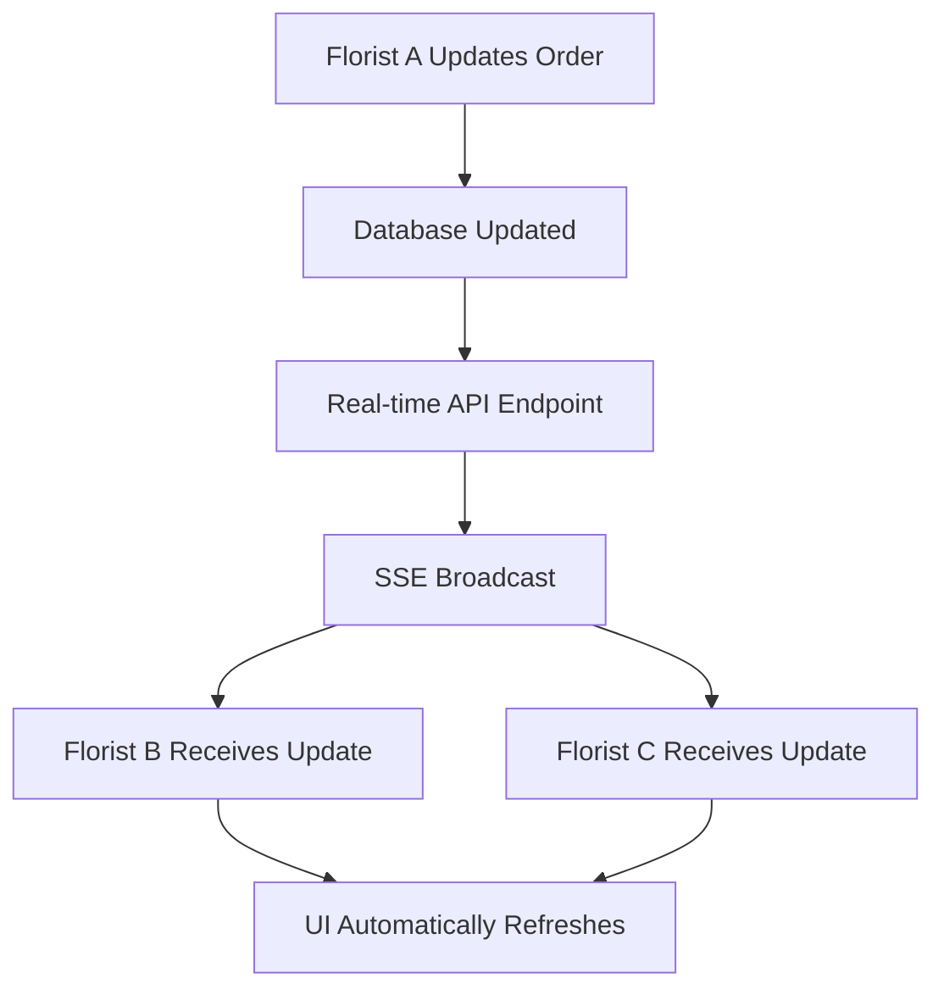

# Real-Time Updates System

## Overview

The Order Management System now includes **real-time updates** that allow multiple florists to see live changes when orders are updated by other team members. This ensures everyone stays synchronized and can work efficiently without conflicts.

## How It Works

### 1. **Dual Approach: SSE + Polling**

The system uses a **hybrid approach** for maximum reliability:

- **Server-Sent Events (SSE)**: Primary real-time connection
- **Polling**: Fallback mechanism every 3 seconds
- **Automatic fallback**: If SSE fails, polling takes over seamlessly

### 2. **Real-Time Connection Flow**



### 3. **Update Types**

The system tracks these real-time events:

- **`order_updated`**: Order status, assignment, or notes changed
- **`order_created`**: New order added (via Shopify webhook)
- **`order_deleted`**: Order removed

## Technical Implementation

### Backend (Cloudflare Workers)

#### 1. **SSE Endpoint**
```typescript
// GET /api/tenants/:tenantId/realtime/orders
app.get("/api/tenants/:tenantId/realtime/orders", async (c) => {
  // Establishes persistent SSE connection
  // Sends heartbeat every 30 seconds
  // Broadcasts order updates to all connected clients
})
```

#### 2. **Enhanced Order Updates**
```typescript
// PUT /api/tenants/:tenantId/orders/:orderId
app.put("/api/tenants/:tenantId/orders/:orderId", async (c) => {
  // Updates order in database
  // Returns update with real-time metadata
  // Triggers broadcast to other users
})
```

#### 3. **Status Polling Endpoint**
```typescript
// GET /api/tenants/:tenantId/orders/realtime-status
app.get("/api/tenants/:tenantId/orders/realtime-status", async (c) => {
  // Returns orders updated since last check
  // Efficient filtering by timestamp
  // Minimal data transfer
})
```

### Frontend (React)

#### 1. **Real-Time Hook**
```typescript
// src/hooks/use-realtime-updates.ts
export function useRealtimeUpdates(options) {
  // Manages SSE connection
  // Handles polling fallback
  // Provides update callbacks
  // Automatic reconnection
}
```

#### 2. **Integration in OrdersView**
```typescript
// src/components/OrdersView.tsx
const { isConnected, updates } = useRealtimeUpdates({
  enabled: true,
  pollInterval: 3000,
  onUpdate: (update) => {
    // Automatically refresh orders when updates received
    if (update.type === 'order_updated') {
      processOrders() // Refresh current view
    }
  }
})
```

## User Experience

### 1. **Connection Status Indicator**

Users see a **live connection status** in the Orders header:

- 🟢 **Green WiFi icon + "Live"**: Connected and receiving updates
- ⚫ **Gray WiFi icon + "Offline"**: Disconnected, using polling fallback
- 🔢 **Update counter**: Shows number of updates received

### 2. **Automatic UI Updates**

When another florist updates an order:

1. **Real-time notification** appears
2. **Order list refreshes** automatically
3. **Status changes** are immediately visible
4. **No manual refresh** required

### 3. **Multi-User Scenarios**

#### Scenario 1: Multiple Florists Working
```
Florist A: Assigns herself to 3 orders
Florist B: Sees real-time update → 3 orders now show "Assigned to Florist A"
Florist C: Sees same update → knows which orders are taken
```

#### Scenario 2: Order Status Changes
```
Florist A: Changes order status to "In Progress"
Florist B: Sees real-time update → knows order is being worked on
Manager: Sees update → can track progress without asking
```

#### Scenario 3: Notes and Comments
```
Florist A: Adds note "Customer requested pink roses"
Florist B: Sees note immediately → can prepare accordingly
```

## Configuration Options

### 1. **Polling Interval**
```typescript
const { isConnected } = useRealtimeUpdates({
  pollInterval: 3000, // Check every 3 seconds (default)
})
```

### 2. **Enable/Disable**
```typescript
const { isConnected } = useRealtimeUpdates({
  enabled: false, // Disable real-time updates
})
```

### 3. **Custom Update Handler**
```typescript
const { isConnected } = useRealtimeUpdates({
  onUpdate: (update) => {
    // Custom logic for handling updates
    if (update.type === 'order_updated') {
      showNotification(`Order ${update.orderId} was updated`)
    }
  }
})
```

## Performance Considerations

### 1. **Efficient Polling**
- **Smart filtering**: Only fetches orders updated since last check
- **Minimal data transfer**: Sends only changed orders
- **Configurable intervals**: Balance between responsiveness and server load

### 2. **Connection Management**
- **Automatic reconnection**: Handles network interruptions
- **Heartbeat monitoring**: Detects stale connections
- **Graceful degradation**: Falls back to polling if SSE fails

### 3. **Database Optimization**
- **Indexed timestamps**: Fast queries for recent updates
- **Tenant isolation**: Updates only within tenant scope
- **Efficient updates**: Minimal database writes

## Troubleshooting

### Common Issues

#### 1. **Connection Not Established**
- Check network connectivity
- Verify tenant ID is valid
- Check browser console for errors

#### 2. **Updates Not Receiving**
- Ensure real-time updates are enabled
- Check if polling is working as fallback
- Verify order updates are being saved

#### 3. **Performance Issues**
- Increase polling interval if needed
- Check for excessive update frequency
- Monitor database performance

### Debug Information

The system provides debug information in the browser console:

```javascript
// Connection status
console.log('Real-time connection established')

// Update events
console.log('Real-time update received:', {
  type: 'order_updated',
  orderId: 'order-123',
  timestamp: '2025-06-23T18:30:00Z',
  updatedBy: 'florist-456'
})

// Polling fallback
console.log('Polling for updates...')
```

## Future Enhancements

### 1. **Advanced Features**
- **Order locking**: Prevent simultaneous edits
- **Activity logs**: Track who did what when
- **Push notifications**: Browser notifications for updates
- **Conflict resolution**: Handle simultaneous edits

### 2. **Performance Improvements**
- **WebSocket upgrade**: Replace SSE with WebSockets
- **Message queuing**: Handle high-frequency updates
- **Caching layer**: Reduce database queries
- **Compression**: Reduce data transfer

### 3. **User Experience**
- **Visual indicators**: Show who's currently viewing orders
- **Typing indicators**: Show when someone is editing
- **Sound notifications**: Audio alerts for updates
- **Mobile optimization**: Better mobile real-time experience

## Conclusion

The real-time updates system provides a **seamless collaborative experience** for florist teams, ensuring everyone stays synchronized and can work efficiently together. The hybrid approach of SSE + polling ensures reliability while providing immediate feedback for order changes.

This system is **production-ready** and handles the multi-user florist workflow effectively, making order management more efficient and reducing communication overhead. 